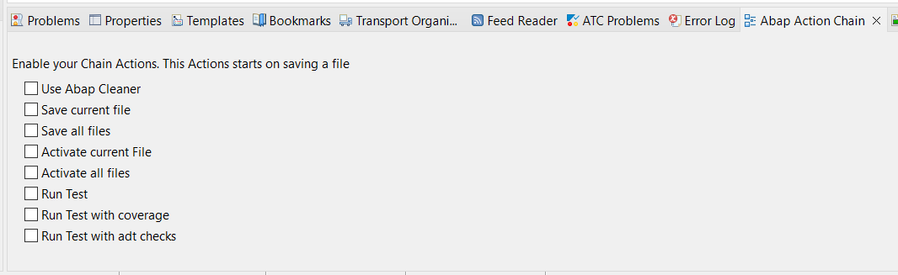

## Abap Action Chain: Eclipse Plugin for ABAP Development ##

Abap Action Chain is a powerful Eclipse plugin designed to streamline ABAP development by enabling users to manage chains of actions. 
With this plugin, developers can automate repetitive tasks throughout their ABAP projects.

# Install 
In Eclipse -> Help -> Install New Software and add url: 

https://pardonmycode.github.io/Abap-Action-Chain/pluginSite/

