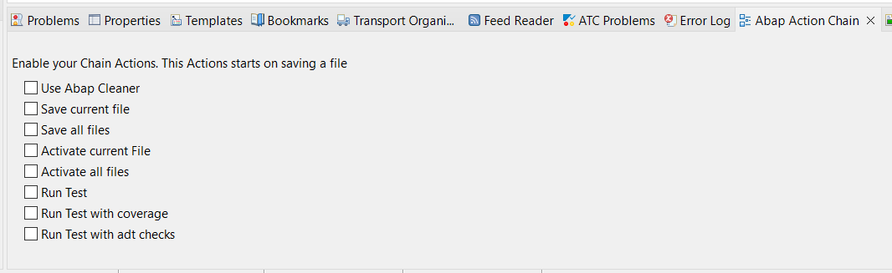

## ActionsChain: Eclipse Plugin for ABAP Development ##

ActionsChain is a powerful Eclipse plugin designed to streamline ABAP development by enabling users to manage chains of actions. With this plugin, developers can automate repetitive tasks throughout their ABAP projects.

